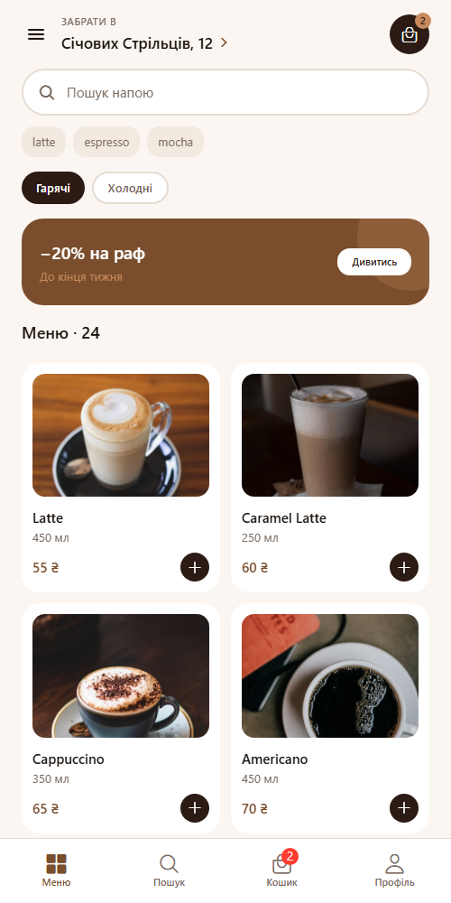
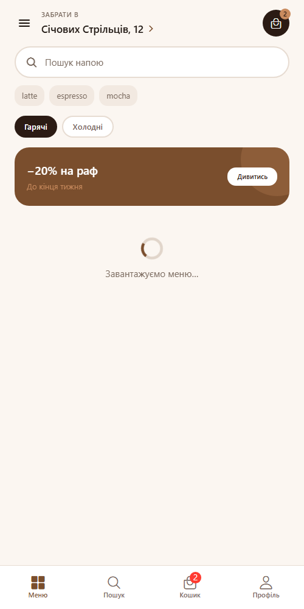
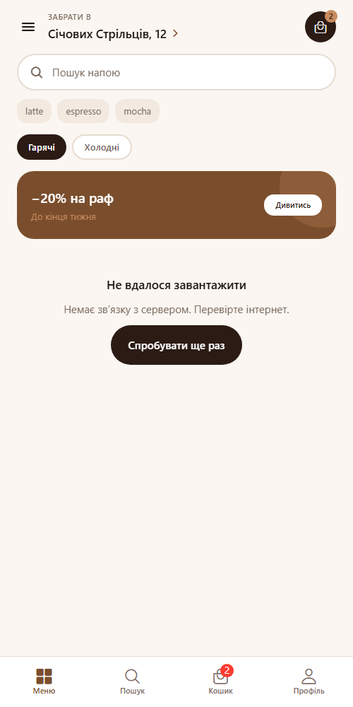
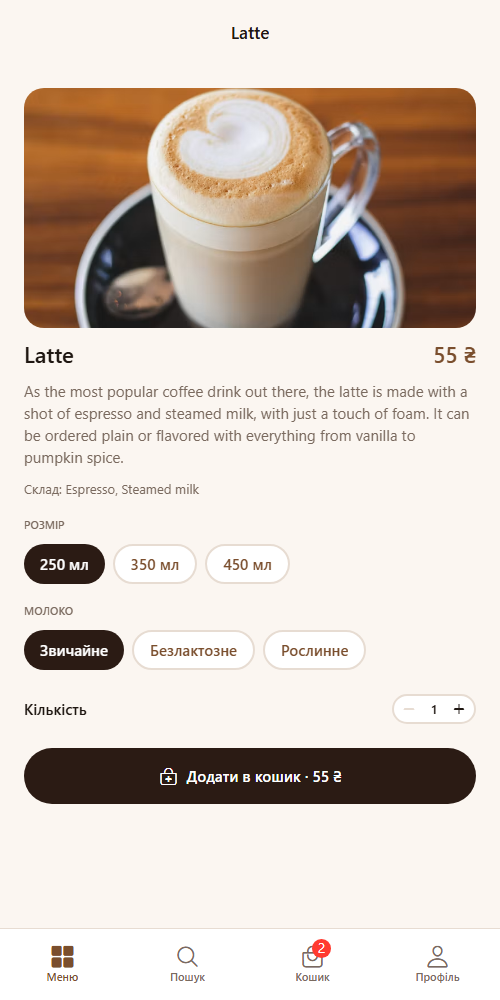
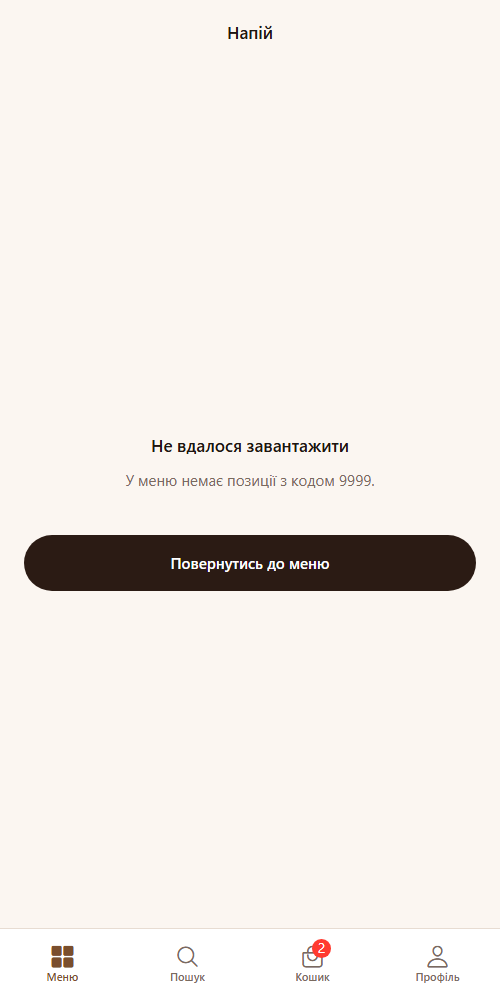
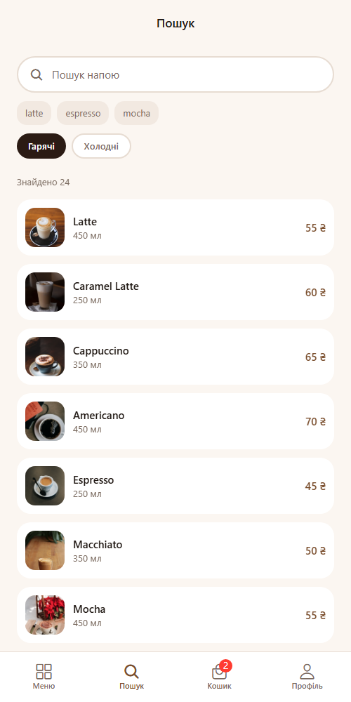
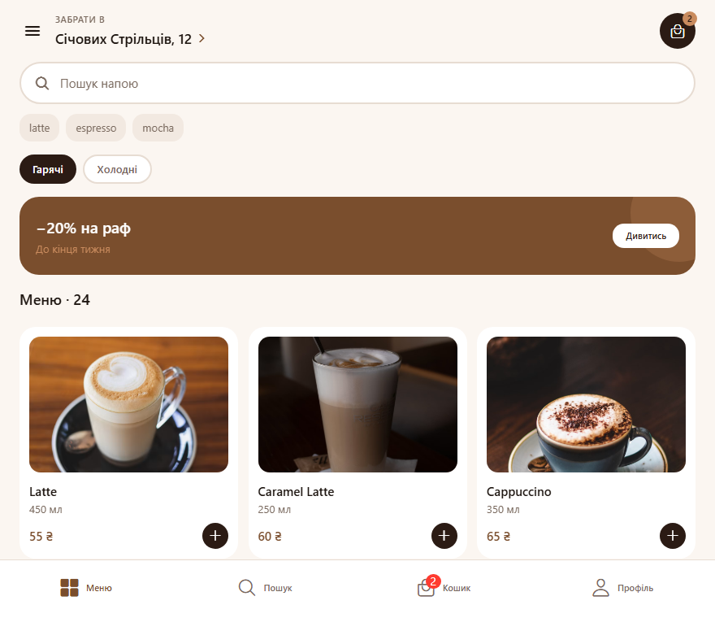

# BrewGo — застосунок для замовлення кави

Мобільний застосунок для замовлення кави на самовивіз. Інтерфейс перенесений з макета Figma
`Яцишин_Ігор_cross_assignment_2`, меню підтягується з публічного REST API.

## Стек

Expo SDK 57, React Native 0.86, React 19, React Navigation 7.

## Запуск

```bash
npm install
npm start
```

Далі `a` — Android, `i` — iOS, `w` — web.

## Структура

```
api/          робота з REST API
hooks/        useCoffeeMenu — запит меню, useCardWidth — ширина картки
navigation/   навігатори, константи маршрутів, спільні опції
screens/      екрани застосунку
components/   UI-компоненти, кожен в окремому файлі
theme/        кольори, типографіка, відступи, радіуси, тіні
data/         локальний сід кошика
```

## API

Джерело даних — [api.sampleapis.com/coffee](https://api.sampleapis.com/coffee), публічний REST API
без ключа. Використані два ендпоінти:

| Запит | Призначення |
| --- | --- |
| `GET /coffee/hot` | гарячі напої, 24 позиції |
| `GET /coffee/iced` | холодні напої |
| `GET /coffee/hot/:id` | один напій для екрана деталей |

Уся логіка запитів лежить в `api/coffee.js`: адреса винесена в константу `API_BASE_URL`,
запити йдуть через `fetch`. API не повертає ціну та обʼєм, тому вони виводяться з `id`
за сталою формулою — той самий напій завжди має ті самі значення. Відповідь мапиться
у формат, який очікують компоненти, тому екрани не працюють із сирими полями API.

`fetch` не має власного таймауту, тому запит обгорнутий в `AbortController` з лімітом 10 секунд —
інакше при мертвій мережі екран крутив би спінер нескінченно.

## Стан запиту

`hooks/useCoffeeMenu.js` тримає стан через `useReducer`: `loading` → `success` або `error`
одним переходом, без трьох окремих `useState`, які могли б розійтися між собою.
Хук повертає `reload`, тому кнопка «Спробувати ще раз» перезапускає запит.

Якщо швидко перемикати категорії, старий запит може завершитися останнім — прапорець `active`
у `useEffect` відкидає протерміновану відповідь.

## Обробка помилок

Три різні ситуації розділені, щоб користувач бачив причину, а не загальне «щось пішло не так»:

| Ситуація | Що показує застосунок |
| --- | --- |
| Немає мережі | «Немає звʼязку з сервером. Перевірте інтернет» + кнопка повтору |
| Сервер не відповів за 10 с | «Сервер не відповів вчасно» |
| Напою з таким `id` немає (404) | «У меню немає позиції з кодом N» + повернення до меню |
| Параметр не передано взагалі | «Екран відкрито без коду напою» |

Компонент `components/RequestState.jsx` малює `ActivityIndicator` під час завантаження
і повідомлення з кнопкою повтору при помилці — один вигляд для всіх екранів.

## Навігація

```
Drawer
├── Tabs
│   ├── Меню    → MenuStack:    Home → ProductDetails
│   ├── Пошук   → SearchStack:  Search → ProductDetails
│   ├── Кошик   → CartStack:    Cart → Checkout → Confirmation
│   └── Профіль → ProfileStack: Profile → OrderHistory
├── Підтримка
└── Про заклад
```

Назви маршрутів зібрані в `navigation/routes.js` — у коді немає рядкових літералів маршрутів.

## Передача параметрів

| Звідки | Куди | Параметр |
| --- | --- | --- |
| Home, Search | ProductDetails | `drinkId`, `category` |
| ProductDetails | Cart (інший таб) | `addedDrinkId`, `category` |
| OrderHistory | Cart (інший таб) | `addedDrinkId` |
| Cart | Checkout | `total` |
| Checkout | Confirmation | `orderNumber`, `total`, `time`, `payment` |

Екрани передають тільки `id`, а не готовий обʼєкт: деталі й кошик самі дотягують напій
через API. Перехід у кошик іде через `navigation.getParent()`, бо кошик живе в сусідньому табі.

На web кожен екран має власний URL: `/menu`, `/menu/:drinkId`, `/search`, `/cart`,
`/checkout`, `/profile`, `/orders`, `/support`, `/about`.

## Компоненти

| Компонент | Пропси |
| --- | --- |
| `CustomButton` | `title`, `variant`, `iconName`, `iconPosition`, `disabled`, `fullWidth`, `onPress` |
| `ProductCard` | `title`, `volume`, `price`, `rating`, `imageUrl`, `width`, `onPress`, `onAdd` |
| `Header` | `label`, `title`, `cartCount`, `onPressMenu`, `onPressLocation`, `onPressCart` |
| `SearchBar` | `value`, `onChangeText`, `placeholder`, `hints`, `onSubmit` |
| `CategoryTabs` | `categories`, `activeId`, `onChange` |
| `CartItem` | `title`, `options`, `price`, `quantity`, `imageUrl`, `onChangeQuantity` |
| `QuantityStepper` | `value`, `min`, `max`, `onChange` |
| `Badge` | `value`, `max`, `backgroundColor` |
| `PromoBanner` | `title`, `subtitle`, `actionLabel`, `onPress` |
| `RequestState` | `status`, `error`, `onRetry`, `loadingText` |

## Адаптивність

`useCardWidth` рахує ширину картки від `useWindowDimensions()`:
`(ширина екрана − поля − проміжки) / кількість колонок`. Від 700 px сітка перемикається
з двох колонок на три.

## Скриншоти

Меню з даними API — 24 напої, категорії `hot` / `iced`:



Стан завантаження:



Помилка мережі з кнопкою повтору:



Деталі напою — окремий запит за `id`, опис і склад із API:



Напою з таким `id` немає:



Пошук по завантаженому меню:



Кошик після додавання з екрана деталей:


Широкий екран — сітка на три колонки:


