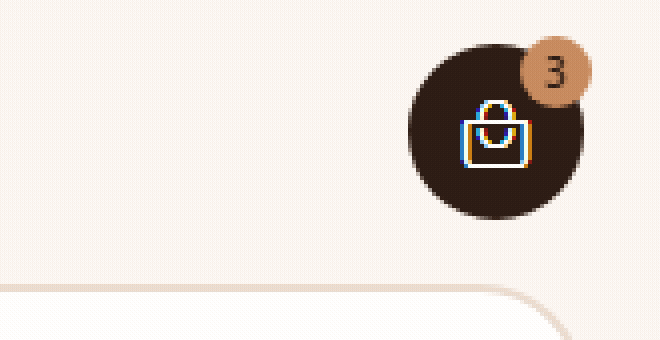
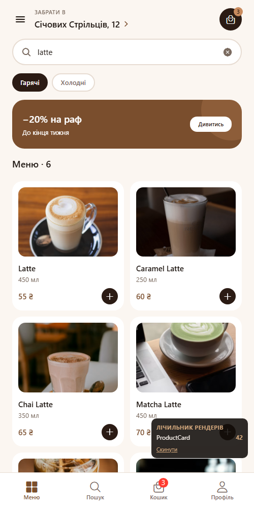
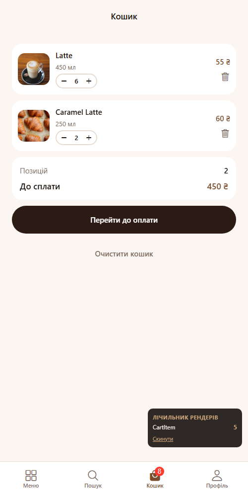
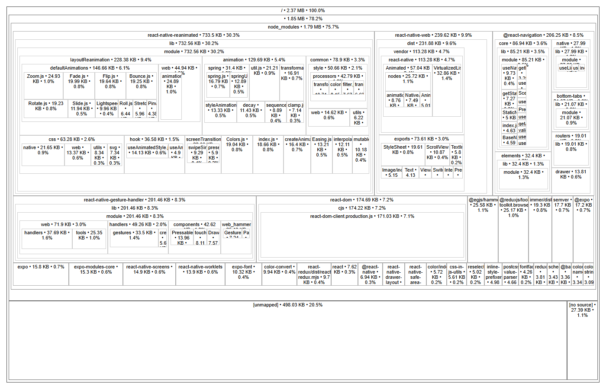
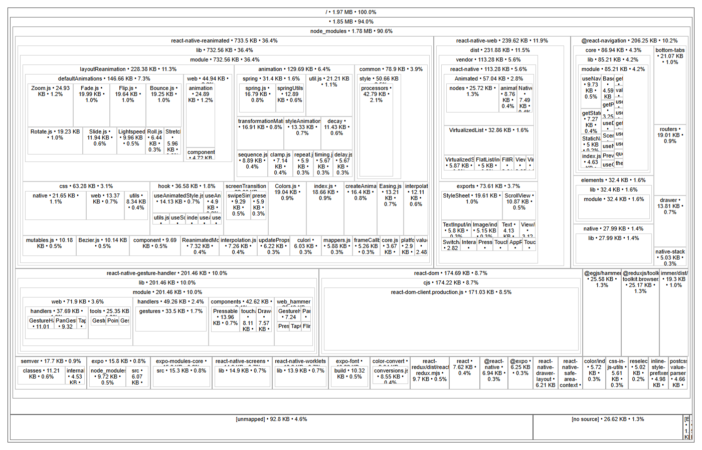

# BrewGo — застосунок для замовлення кави

Мобільний застосунок для замовлення кави на самовивіз. Інтерфейс перенесений з макета Figma
`Яцишин_Ігор_cross_assignment_2`, меню підтягується з публічного REST API,
глобальний стан розділений між Context API і Redux.

## Стек

Expo SDK 57, React Native 0.86, React 19, React Navigation 7, Redux Toolkit 2,
Reanimated 4.

## Запуск

```bash
npm install
npm start
```

Далі `a` — Android, `i` — iOS, `w` — web.

## Структура

```
context/      ThemeContext — тема через Context API
store/        cartSlice і configureStore — кошик через Redux
api/          робота з REST API
hooks/        useCoffeeMenu — запит меню, useCardWidth — ширина картки
navigation/   навігатори, константи маршрутів, спільні опції
screens/      екрани застосунку
components/   UI-компоненти, кожен в окремому файлі
theme/        палітри, типографіка, відступи, радіуси, тіні
data/         локальний сід кошика
dev/          лічильник рендерів для замірів, не потрапляє у продакшн-бандл
```

## Розподіл глобального стану

| Аспект | Інструмент | Чому так |
| --- | --- | --- |
| Тема (світла / темна) | Context API | Читається майже кожним компонентом, змінюється рідко й одним перемикачем. Редюсери й екшени тут були б зайвою церемонією |
| Кошик | Redux Toolkit | Змінюється з трьох різних місць (деталі напою, історія замовлень, сам кошик), має кілька операцій і похідні значення — лічильник у табі та сума |
| Меню з API | локальний стан екрана | Свідомо **не** виносив у глобальний стан: дані залежать від обраної категорії й потрібні лише двом екранам |

## Context API — тема

`context/ThemeContext.jsx` тримає режим (`light` / `dark`) і віддає готову палітру.
Провайдер обгортає застосунок у `App.js`, доступ — через хук `useTheme`, який кидає
зрозумілу помилку, якщо його викликати поза провайдером.

Дві палітри з однаковими ключами лежать у `theme/palettes.js`, тому компонент
не знає, яка тема активна — він просто бере `colors` з контексту:

```js
const { colors } = useTheme();
const styles = useMemo(() => createStyles(colors), [colors]);
```

Стилі стали фабриками `createStyles(colors)` замість статичних обʼєктів — інакше
`StyleSheet.create` зафіксував би кольори однієї теми назавжди. `useMemo` не дає
перераховувати їх на кожному рендері.

Тема застосована наскрізно: усі 10 компонентів, усі 9 екранів, а також заголовки стеків,
таб-бар і drawer через `createStackScreenOptions(colors)` та сусідні фабрики.
Перемикач — `Switch` на екрані профілю, єдине місце, яке пише в контекст.

## Redux — кошик

`store/cartSlice.js` містить чотири редюсери:

| Дія | Що робить |
| --- | --- |
| `addItem` | додає напій; якщо такий уже є — збільшує кількість, а не створює дубль |
| `removeItem` | прибирає позицію за `id` рядка |
| `updateQuantity` | змінює кількість; падіння нижче одиниці видаляє позицію |
| `clearCart` | очищає кошик |

Похідні значення винесені в селектори `selectCartItems`, `selectCartCount`,
`selectCartTotal`, тому компоненти не рахують суму самі.

Store зібраний через `configureStore`, підключений `<Provider>` у `App.js`.
Використання в екранах:

- `CartScreen` — `useSelector` для списку й суми, `useDispatch` для всіх операцій
- `ProductDetailsScreen` — `dispatch(addItem(drink))`, напій уже завантажений, тому без повторного запиту
- `HomeScreen` і `TabNavigator` — `selectCartCount` для лічильника в шапці та бейджа на табі

Ідентифікатор рядка передається в `CartItem` пропсом, тож сам компонент нічого не знає
про store і лишається придатним до перевикористання.

## API

Джерело даних — [api.sampleapis.com/coffee](https://api.sampleapis.com/coffee).
Логіка запитів в `api/coffee.js`, адреса в константі `API_BASE_URL`, таймаут 10 с
через `AbortController`. Стан запиту — `useReducer` в `hooks/useCoffeeMenu.js`.

Обробка помилок розділена: немає мережі, таймаут, і 404 на неіснуючий напій —
кожен випадок дає свій текст, а не загальне «щось пішло не так».

## Навігація

```
Drawer
├── Tabs
│   ├── Меню    → MenuStack:    Home → ProductDetails
│   ├── Пошук   → SearchStack:  Search → ProductDetails
│   ├── Кошик   → CartStack:    Cart → Checkout → Confirmation
│   └── Профіль → ProfileStack: Profile → OrderHistory
├── Підтримка
└── Про заклад
```

Назви маршрутів — у `navigation/routes.js`. На web кожен екран має власний URL:
`/menu`, `/menu/:drinkId`, `/search`, `/cart`, `/checkout`, `/profile`, `/orders`.

## Константи

Кольори — `theme/palettes.js`, відступи й радіуси — `theme/metrics.js`,
межі кількості — `MIN_QUANTITY` / `MAX_QUANTITY` у слайсі, адреса API — `API_BASE_URL`,
назви екранів — `SCREENS` / `STACKS`. Числових літералів у стилях немає.

## Оптимізація продуктивності

### Аналіз

| Що шукали | Знайдено |
| --- | --- |
| Компонент під анімацію | `ProductDetailsScreen` — опис і склад напою висіли статичним текстом; `Badge` — лічильник кошика змінював число без жодної реакції; `CartItem` — позиція зникала зі списку миттєво |
| Зайві ререндери | `ProductCard` перемальовувався на кожен символ у пошуку, `CartItem` — на будь-яку зміну кошика. Причина в обох випадках спільна: `renderItem` створював нові функції-пропси на кожному рендері, а фільтрація списку виконувалась у тілі компонента |
| Великі залежності | `moment` чи `lodash` у проєкті немає. Натомість усі 11 файлів імпортували `{ Ionicons } from '@expo/vector-icons'` — бочковий імпорт, який підключає всі 15 сімейств іконок разом із гліф-мапами та шрифтами |

Щодо четвертого завдання: ТЗ наводить заміну `moment` → `dayjs` як приклад. Важкої зайвої
залежності, яку можна було б викинути без втрати функціональності, у проєкті немає —
стоять лише Expo, React Navigation, Redux Toolkit і Reanimated. Тому розмір бандла
зменшений іншим способом, описаним нижче, а не штучним додаванням пакета заради заміни.

### Анімації — Reanimated

Усі три через `useSharedValue` / `useAnimatedStyle`, без `LayoutAnimation`:
на web він у `react-native-web` не реалізований, тож перевірити його в браузері було б неможливо.

| Компонент | Що анімовано | API |
| --- | --- | --- |
| `components/Collapsible.jsx` | висота блоку «Опис і склад» і поворот шеврона від одного shared value | `withTiming` |
| `components/Badge.jsx` | лічильник кошика підскакує при зміні й осідає назад | `withSequence` + `withSpring` |
| `components/CartItem.jsx` | поява й зникання позиції, решта рядків з'їжджає на місце | `FadeInDown` / `FadeOutRight` / `LinearTransition` |

Акордеон вимірює висоту вмісту через `onLayout`, бо опис напою приходить з API
і має різну довжину. Виміряний блок позиціонований абсолютно, тому видима висота
береться лише з анімованого стилю.

Розгортання опису напою:


Видалення позиції з кошика — рядок іде вправо, сусідній підіймається:


Пружина бейджа при додаванні напою з меню (збільшено):



### Оптимізація ререндерів

`React.memo` сам по собі тут не дав би нічого: доки `onPress` і `onAdd` створюються
заново на кожному рендері, поверхневе порівняння пропсів завжди провалюється. Тому
картка й рядок кошика приймають власний `id` і віддають його назад у колбеку, а екран
тримає **одну** функцію на весь список.

| Місце | Було | Стало |
| --- | --- | --- |
| `ProductCard`, `CartItem`, `QuantityStepper`, `CategoryTabs`, `PromoBanner`, `Header` | звичайні компоненти | `React.memo` |
| `HomeScreen`, `SearchScreen` | `drinks.filter(...)` у тілі компонента | `useMemo` за `[drinks, query]` |
| `HomeScreen`, `SearchScreen`, `CartScreen` | інлайнові стрілки в `renderItem` і `.map()` | `useCallback` на `openDrink`, `addToCart`, `changeQuantity`, `remove` |
| `HomeScreen` | `ListHeaderComponent` перебудовувався щоразу | `useMemo` |
| `keyExtractor` | нова функція на кожен рендер | винесений у модуль |

`SearchBar` свідомо лишений без `memo`: його `value` змінюється на кожен символ,
тож порівняння пропсів завжди провалювалось би — це були б витрати без користі.

Перевірка — лічильник рендерів у `dev/`. Хук `useRenderLog` рахує рендери
`ProductCard` і `CartItem`, а панель `RenderStatsOverlay` показує підсумок на екрані.
Обидва закриті `__DEV__`; у продакшн-збірці Metro викидає їх разом із текстом панелі
(перевірено пошуком по експортованому бандлу).

**Сценарій 1** — набір слова «latte» у пошуку меню, п'ять символів:

| До | Після |
| --- | --- |
|  |  |
| 42 рендери `ProductCard` | 16 рендерів, **−62 %** |

**Сценарій 2** — п'ять змін кількості в одній позиції кошика з двох:

| До | Після |
| --- | --- |
|  |  |
| 10 рендерів `CartItem` — перемальовувались обидві позиції | 5 рендерів, **−50 %**: лише та, що змінилась |

### Розмір бандла

Попри назву, `@expo/vector-icons/build/IconsLazy.js` підключає всі сімейства іконок
через `require()` на верхньому рівні — лінивими є тільки геттери. Тому бочковий імпорт
тягнув у збірку 15 наборів, їхні гліф-мапи та 19 файлів шрифтів, хоч застосунок
використовує одне сімейство.

Заміна в усіх 11 файлах:

```diff
-import { Ionicons } from '@expo/vector-icons';
+import Ionicons from '@expo/vector-icons/Ionicons';
```

| Метрика | До | Після | Зміна |
| --- | --- | --- | --- |
| JS-бандл | 2 482 227 B | 2 061 189 B | −421 038 B (−16,9 %) |
| з них гліф-мапи (`[unmapped]`) | 509 982 B | 95 024 B | −414 958 B |
| JS самого `@expo/vector-icons` | 17 613 B | 6 405 B | −11 208 B |
| Шрифти іконок | 19 файлів, 4 076 840 B | 1 файл, 389 724 B | −3 687 116 B |
| Уся збірка без source maps | 6 579 380 B | 2 471 226 B | **−62,4 %** |

Відтворення заміру:

```bash
npx expo export --platform web --source-maps --output-dir dist
npx source-map-explorer "dist/_expo/static/js/web/*.js" --no-border-checks
```

Треємап до оптимізації — блок `[unmapped]` на 498 КБ це гліф-мапи невикористаних наборів:



Після — лишився тільки `Ionicons`:



Анімації та лічильник додали до JS близько 6,5 КБ — це різниця між збіркою
з самим лише точковим імпортом іконок і фінальною.

## Скриншоти

### Context API — перемикач теми

Світла тема, перемикач вимкнено:


Той самий екран після перемикання — змінились фон, картки, текст, таб-бар і заголовок:


Тема застосована до всього застосунку, не лише до екрана з перемикачем:


### Redux — кошик

Список із Redux: степер кількості, кнопка видалення на кожній позиції,
сума й кількість із селекторів, бейдж на табі:


Той самий кошик у темній темі — Context і Redux працюють незалежно:


