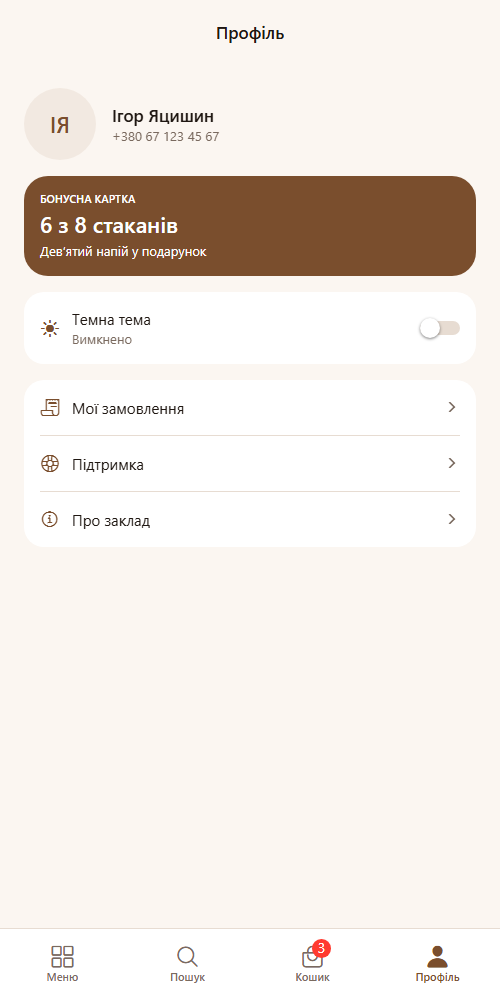
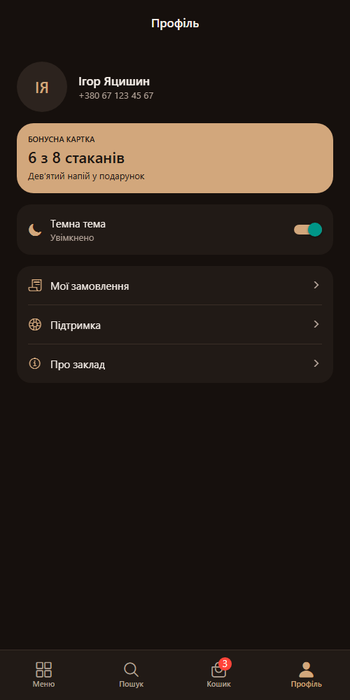
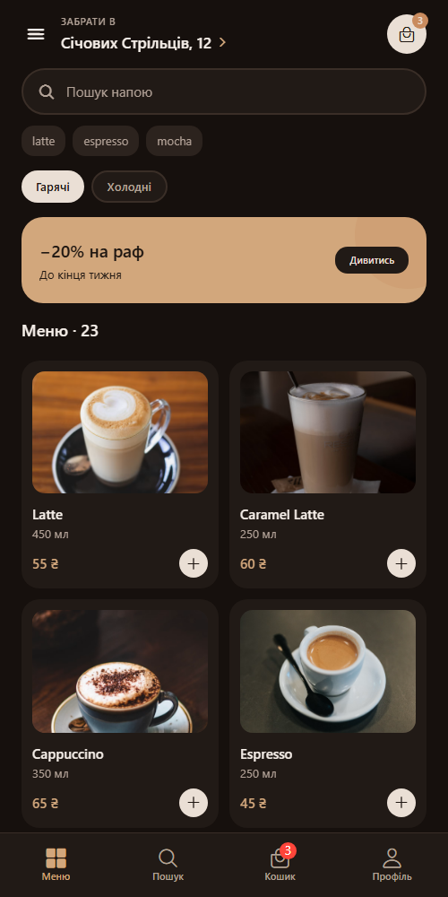
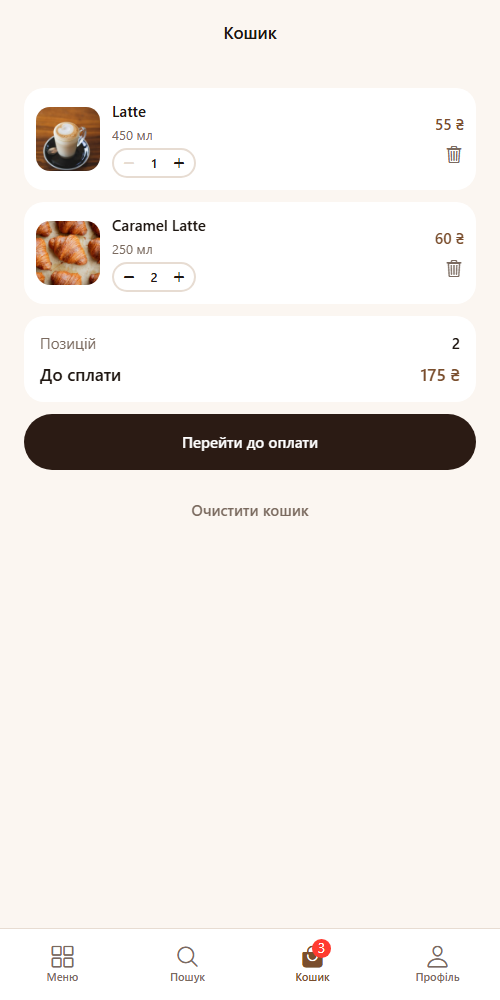
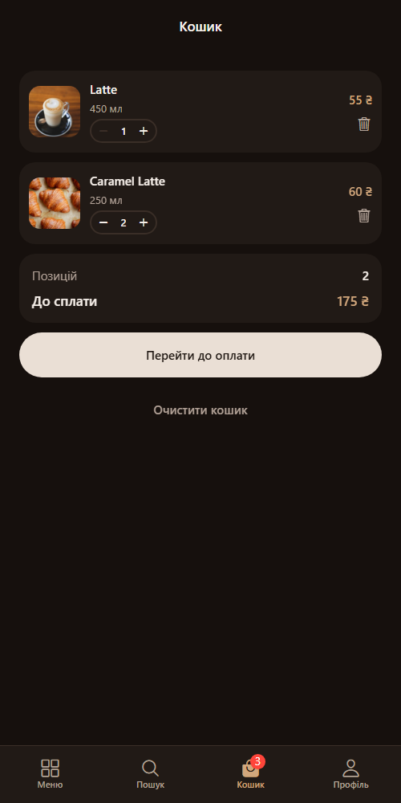

# BrewGo — застосунок для замовлення кави

Мобільний застосунок для замовлення кави на самовивіз. Інтерфейс перенесений з макета Figma
`Яцишин_Ігор_cross_assignment_2`, меню підтягується з публічного REST API,
глобальний стан розділений між Context API і Redux.

## Стек

Expo SDK 57, React Native 0.86, React 19, React Navigation 7, Redux Toolkit 2.

## Запуск

```bash
npm install
npm start
```

Далі `a` — Android, `i` — iOS, `w` — web.

## Структура

```
context/      ThemeContext — тема через Context API
store/        cartSlice і configureStore — кошик через Redux
api/          робота з REST API
hooks/        useCoffeeMenu — запит меню, useCardWidth — ширина картки
navigation/   навігатори, константи маршрутів, спільні опції
screens/      екрани застосунку
components/   UI-компоненти, кожен в окремому файлі
theme/        палітри, типографіка, відступи, радіуси, тіні
data/         локальний сід кошика
```

## Розподіл глобального стану

| Аспект | Інструмент | Чому так |
| --- | --- | --- |
| Тема (світла / темна) | Context API | Читається майже кожним компонентом, змінюється рідко й одним перемикачем. Редюсери й екшени тут були б зайвою церемонією |
| Кошик | Redux Toolkit | Змінюється з трьох різних місць (деталі напою, історія замовлень, сам кошик), має кілька операцій і похідні значення — лічильник у табі та сума |
| Меню з API | локальний стан екрана | Свідомо **не** виносив у глобальний стан: дані залежать від обраної категорії й потрібні лише двом екранам |

## Context API — тема

`context/ThemeContext.jsx` тримає режим (`light` / `dark`) і віддає готову палітру.
Провайдер обгортає застосунок у `App.js`, доступ — через хук `useTheme`, який кидає
зрозумілу помилку, якщо його викликати поза провайдером.

Дві палітри з однаковими ключами лежать у `theme/palettes.js`, тому компонент
не знає, яка тема активна — він просто бере `colors` з контексту:

```js
const { colors } = useTheme();
const styles = useMemo(() => createStyles(colors), [colors]);
```

Стилі стали фабриками `createStyles(colors)` замість статичних обʼєктів — інакше
`StyleSheet.create` зафіксував би кольори однієї теми назавжди. `useMemo` не дає
перераховувати їх на кожному рендері.

Тема застосована наскрізно: усі 10 компонентів, усі 9 екранів, а також заголовки стеків,
таб-бар і drawer через `createStackScreenOptions(colors)` та сусідні фабрики.
Перемикач — `Switch` на екрані профілю, єдине місце, яке пише в контекст.

## Redux — кошик

`store/cartSlice.js` містить чотири редюсери:

| Дія | Що робить |
| --- | --- |
| `addItem` | додає напій; якщо такий уже є — збільшує кількість, а не створює дубль |
| `removeItem` | прибирає позицію за `id` рядка |
| `updateQuantity` | змінює кількість; падіння нижче одиниці видаляє позицію |
| `clearCart` | очищає кошик |

Похідні значення винесені в селектори `selectCartItems`, `selectCartCount`,
`selectCartTotal`, тому компоненти не рахують суму самі.

Store зібраний через `configureStore`, підключений `<Provider>` у `App.js`.
Використання в екранах:

- `CartScreen` — `useSelector` для списку й суми, `useDispatch` для всіх операцій
- `ProductDetailsScreen` — `dispatch(addItem(drink))`, напій уже завантажений, тому без повторного запиту
- `HomeScreen` і `TabNavigator` — `selectCartCount` для лічильника в шапці та бейджа на табі

Ідентифікатор рядка передається в `CartItem` пропсом, тож сам компонент нічого не знає
про store і лишається придатним до перевикористання.

## API

Джерело даних — [api.sampleapis.com/coffee](https://api.sampleapis.com/coffee).
Логіка запитів в `api/coffee.js`, адреса в константі `API_BASE_URL`, таймаут 10 с
через `AbortController`. Стан запиту — `useReducer` в `hooks/useCoffeeMenu.js`.

Обробка помилок розділена: немає мережі, таймаут, і 404 на неіснуючий напій —
кожен випадок дає свій текст, а не загальне «щось пішло не так».

## Навігація

```
Drawer
├── Tabs
│   ├── Меню    → MenuStack:    Home → ProductDetails
│   ├── Пошук   → SearchStack:  Search → ProductDetails
│   ├── Кошик   → CartStack:    Cart → Checkout → Confirmation
│   └── Профіль → ProfileStack: Profile → OrderHistory
├── Підтримка
└── Про заклад
```

Назви маршрутів — у `navigation/routes.js`. На web кожен екран має власний URL:
`/menu`, `/menu/:drinkId`, `/search`, `/cart`, `/checkout`, `/profile`, `/orders`.

## Константи

Кольори — `theme/palettes.js`, відступи й радіуси — `theme/metrics.js`,
межі кількості — `MIN_QUANTITY` / `MAX_QUANTITY` у слайсі, адреса API — `API_BASE_URL`,
назви екранів — `SCREENS` / `STACKS`. Числових літералів у стилях немає.

## Скриншоти

### Context API — перемикач теми

Світла тема, перемикач вимкнено:



Той самий екран після перемикання — змінились фон, картки, текст, таб-бар і заголовок:



Тема застосована до всього застосунку, не лише до екрана з перемикачем:



### Redux — кошик

Список із Redux: степер кількості, кнопка видалення на кожній позиції,
сума й кількість із селекторів, бейдж на табі:



Той самий кошик у темній темі — Context і Redux працюють незалежно:


