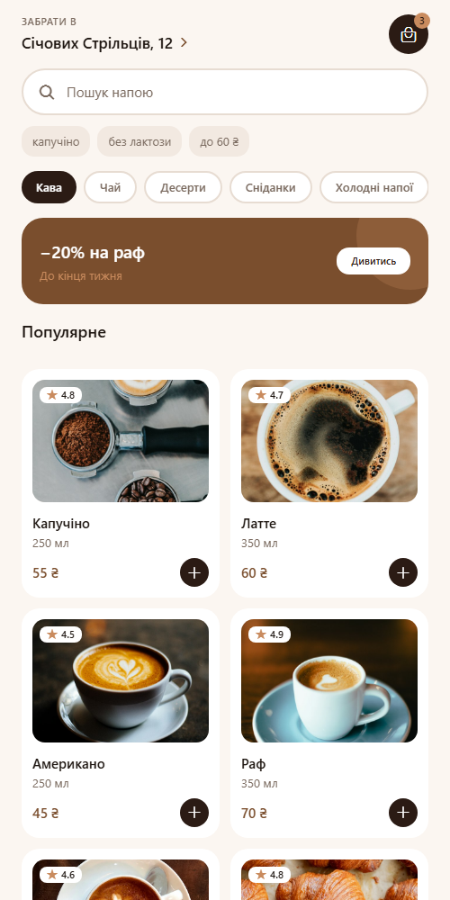
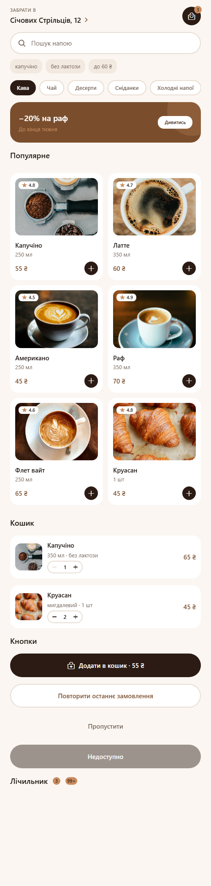
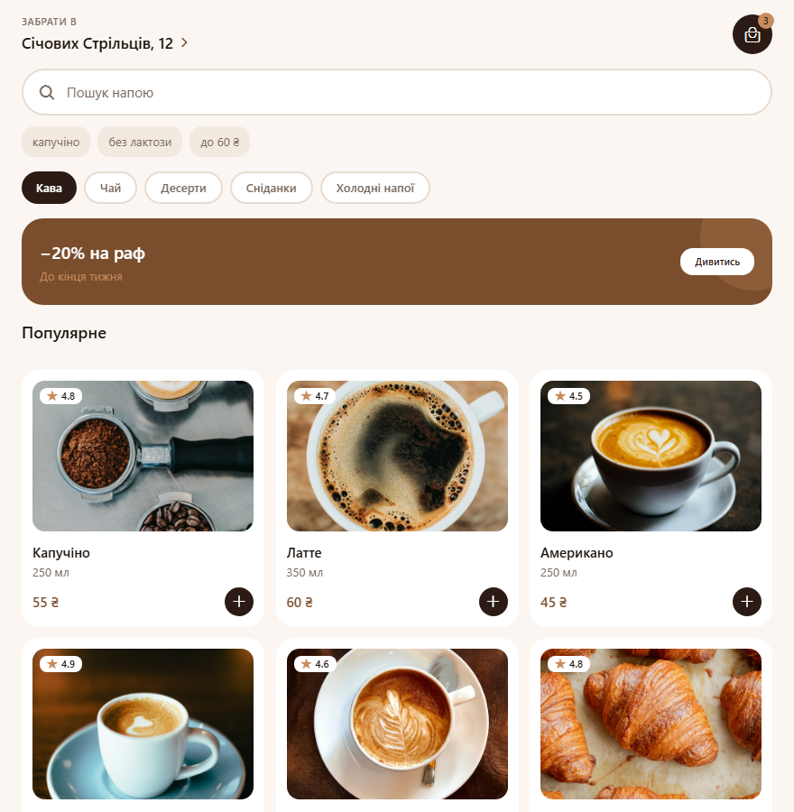

# BrewGo — UI-компоненти

Застосунок для замовлення кави на самовивіз. Компоненти перенесені з макета Figma
`Яцишин_Ігор_cross_assignment_2`.

## Стек

Expo SDK 57, React Native 0.86, React 19.

## Запуск

```bash
npm install
npm start
```

Далі `a` — Android, `i` — iOS, `w` — web.

## Структура

```
components/   UI-компоненти, кожен в окремому файлі
hooks/        useCardWidth — розрахунок ширини картки
theme/        кольори, типографіка, відступи, радіуси, тіні
data/         дані для демонстрації
App.js        екран зі списком усіх компонентів
```

## Компоненти

| Компонент | Пропси |
| --- | --- |
| `CustomButton` | `title`, `variant`, `iconName`, `iconPosition`, `disabled`, `fullWidth`, `onPress` |
| `ProductCard` | `title`, `volume`, `price`, `rating`, `imageUrl`, `width`, `onPress`, `onAdd` |
| `Header` | `label`, `title`, `cartCount`, `onPressLocation`, `onPressCart` |
| `SearchBar` | `value`, `onChangeText`, `placeholder`, `hints`, `onSubmit` |
| `CategoryTabs` | `categories`, `activeId`, `onChange` |
| `CartItem` | `title`, `options`, `price`, `quantity`, `imageUrl`, `onChangeQuantity` |
| `QuantityStepper` | `value`, `min`, `max`, `onChange` |
| `Badge` | `value`, `max`, `backgroundColor` |
| `PromoBanner` | `title`, `subtitle`, `actionLabel`, `onPress` |

## Реалізація

- Компоненти RN: `View`, `Text`, `Image`, `TextInput`, `TouchableOpacity`,
  `ScrollView` (категорії), `FlatList` (сітка напоїв — `numColumns`, `keyExtractor`,
  `ListHeaderComponent`, `ListFooterComponent`).
- Стилі: `StyleSheet.create()`, Flexbox, `Platform.select()` у `theme/shadows.js`
  (тіні iOS / Android) і `theme/typography.js` (гарнітури).
- Адаптивність: `useWindowDimensions()` у `hooks/useCardWidth.js`;
  ширина картки = (ширина екрана − поля − проміжки) / кількість колонок;
  від 700 px сітка перемикається з двох колонок на три.
- Константи кольорів, відступів, радіусів і розмірів — у `theme/`.

## Скриншоти

Головний екран:



Усі компоненти:



Широкий екран — три колонки:


