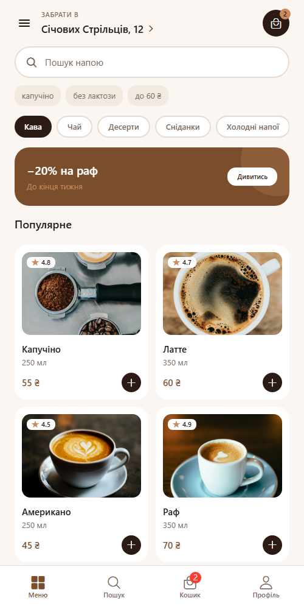
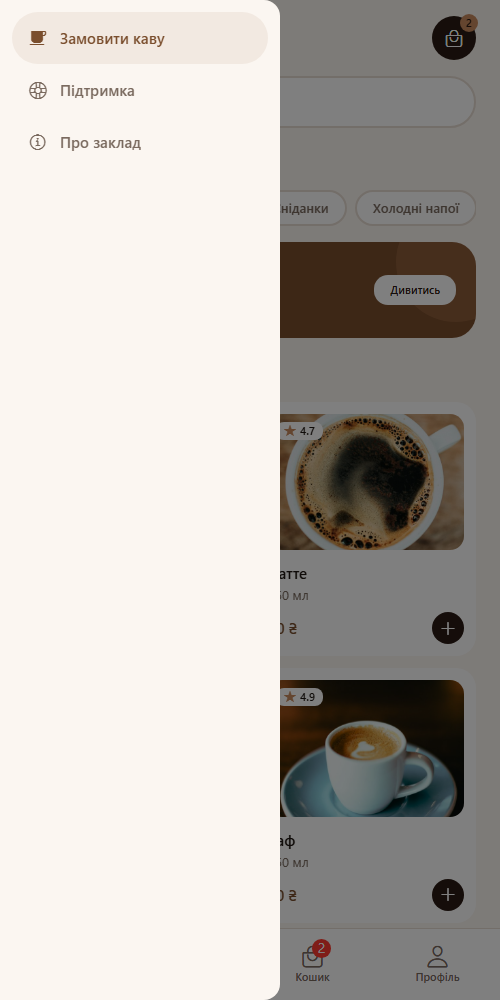
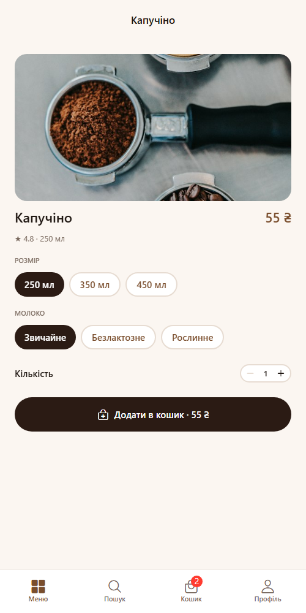
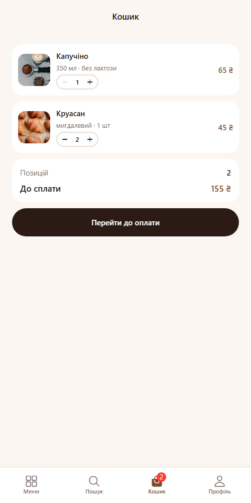
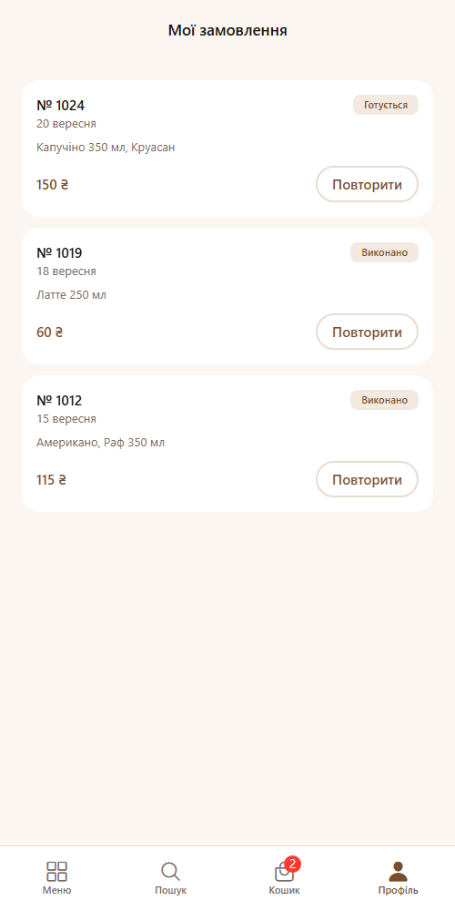
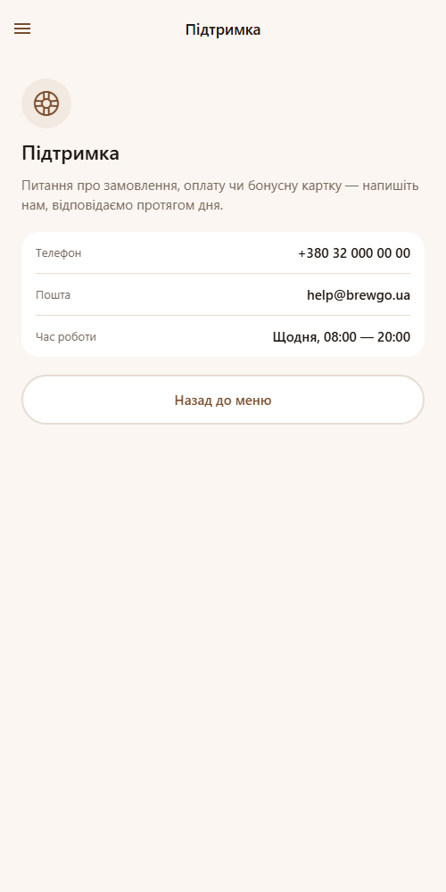
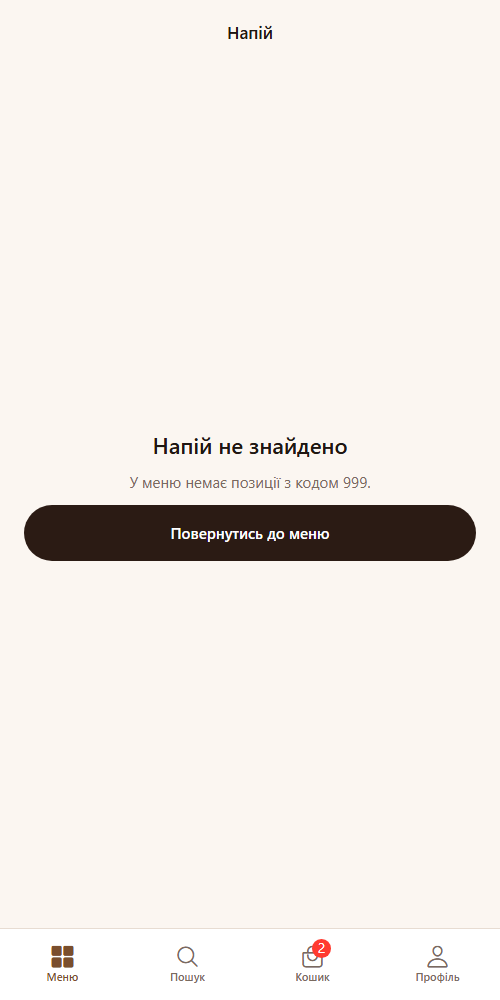
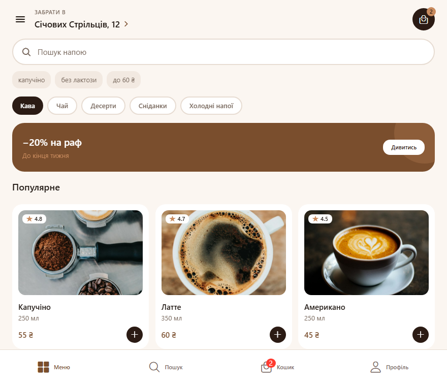

# BrewGo — застосунок для замовлення кави

Мобільний застосунок для замовлення кави на самовивіз. Інтерфейс перенесений з макета Figma
`Яцишин_Ігор_cross_assignment_2`.

## Стек

Expo SDK 57, React Native 0.86, React 19, React Navigation 7.

## Запуск

```bash
npm install
npm start
```

Далі `a` — Android, `i` — iOS, `w` — web.

## Структура

```
navigation/   навігатори, константи маршрутів, спільні опції
screens/      екрани застосунку
components/   UI-компоненти, кожен в окремому файлі
hooks/        useCardWidth — розрахунок ширини картки
theme/        кольори, типографіка, відступи, радіуси, тіні
data/         дані для демонстрації
```

## Навігація

```
Drawer
├── Tabs
│   ├── Меню    → MenuStack:    Home → ProductDetails
│   ├── Пошук   → SearchStack:  Search → ProductDetails
│   ├── Кошик   → CartStack:    Cart → Checkout → Confirmation
│   └── Профіль → ProfileStack: Profile → OrderHistory
├── Підтримка
└── Про заклад
```

Таби повторюють нижню навігацію з макета, стеки відповідають за переходи вглиб,
drawer тримає розділи, яких у макеті на табах немає.

Назви маршрутів зібрані в `navigation/routes.js` (`SCREENS`, `STACKS`, `DRAWER`) —
у коді немає рядкових літералів маршрутів.

## Передача параметрів

| Звідки | Куди | Параметр |
| --- | --- | --- |
| Home, Search | ProductDetails | `productId` |
| ProductDetails | Cart (інший таб) | `addedProductId` |
| OrderHistory | Cart (інший таб) | `addedProductId` |
| Cart | Checkout | `total` |
| Checkout | Confirmation | `orderNumber`, `total`, `time`, `payment` |

Перехід у кошик іде через `navigation.getParent()`, бо кошик живе в сусідньому табі:
`getParent()` дістає таб-навігатор, а `screen` і `params` пробрасують дані всередину його стека.

## Обробка помилок

- `ProductDetails` не довіряє параметрам: якщо `productId` не передано або напою з таким кодом
  немає в меню, замість порожнього екрана показується стан «Напій не знайдено» з кнопкою
  повернення. Заголовок у цьому випадку падає на дефолтний.
- `Cart` ігнорує невідомий `addedProductId`, а після обробки очищає параметр через
  `navigation.setParams`, інакше повернення на таб додавало б ту саму позицію повторно.

## Веб-маршрути

`NavigationContainer` отримує `linking`-конфіг, тому на web кожен екран має власний URL:
`/menu`, `/menu/:productId`, `/search`, `/cart`, `/checkout`, `/confirmation`,
`/profile`, `/orders`, `/support`, `/about`.

## Стилізація навігації

Спільні опції лежать у `navigation/screenOptions.js`: кольори заголовків, вирівнювання,
прибрана тінь, фон контенту, стиль таб-бару та drawer. `Platform.select` вмикає свайп-назад
тільки на iOS. `ProductDetails` підставляє назву напою в заголовок через `navigation.setOptions`,
`Confirmation` вимикає кнопку «Назад» і жест, бо замовлення вже оформлене.

## Компоненти

| Компонент | Пропси |
| --- | --- |
| `CustomButton` | `title`, `variant`, `iconName`, `iconPosition`, `disabled`, `fullWidth`, `onPress` |
| `ProductCard` | `title`, `volume`, `price`, `rating`, `imageUrl`, `width`, `onPress`, `onAdd` |
| `Header` | `label`, `title`, `cartCount`, `onPressMenu`, `onPressLocation`, `onPressCart` |
| `SearchBar` | `value`, `onChangeText`, `placeholder`, `hints`, `onSubmit` |
| `CategoryTabs` | `categories`, `activeId`, `onChange` |
| `CartItem` | `title`, `options`, `price`, `quantity`, `imageUrl`, `onChangeQuantity` |
| `QuantityStepper` | `value`, `min`, `max`, `onChange` |
| `Badge` | `value`, `max`, `backgroundColor` |
| `PromoBanner` | `title`, `subtitle`, `actionLabel`, `onPress` |

## Адаптивність

`useCardWidth` рахує ширину картки від `useWindowDimensions()`:
`(ширина екрана − поля − проміжки) / кількість колонок`. Від 700 px сітка перемикається
з двох колонок на три.

## Скриншоти

Головний екран, нижні таби:



Drawer:



Деталі напою — відкриті переходом з параметром `productId`, назва підставлена в заголовок:



Кошик після переходу з деталей:



Історія замовлень із дією «Повторити»:



Екран drawer:



Обробка помилки — екран відкрито з неіснуючим `productId`:



Широкий екран — сітка на три колонки:


